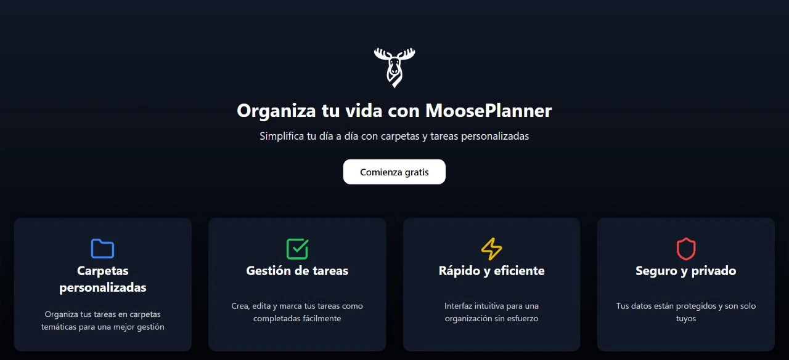
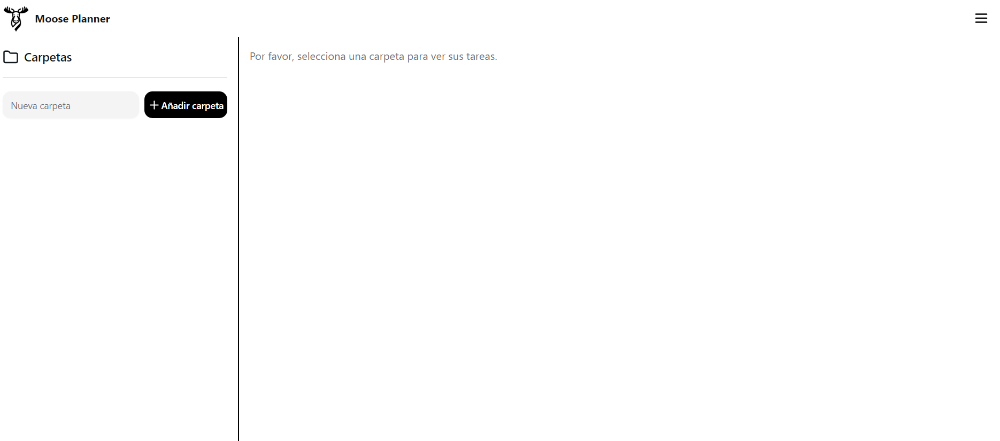

<p align="center">
  
  <span style="font-size: 2.5em; font-weight: bold;">Moose Planner</span>
</p>

<p align="center">
  <strong>Organiza tus tareas de manera eficiente</strong>
</p>

---

**Moose Planner** es una aplicación desarrollada con **React** y **Vite** para la gestión organizada de carpetas y tareas. Diseñada para maximizar la productividad, permite a los usuarios estructurar y administrar sus actividades eficientemente.

## 🚀 Estado del Proyecto
El proyecto está en desarrollo, aunque las funcionalidades principales ya están operativas.

## 📋 Contenidos
- [📷 Fotos del proyecto](#📷-fotos-del-proyecto)
- [✨ Funcionalidades](#✨-funcionalidades)
- [🛠️ Tecnologías Usadas](#🛠️-tecnologías-usadas)
- [📦 Cómo Obtener el Proyecto](#📦-cómo-obtener-el-proyecto)
- [🌐 Deploy en Render](#🌐-deploy-en-render)
- [💭 Reflexión del Proyecto](#💭-reflexión-del-proyecto)

## 📷 Fotos del Proyecto
<div align="center">
    
    
</div>

## ✨ Funcionalidades
### 🔒 Autenticación
- Registro de cuenta
- Inicio de sesión
- Cierre de sesión

### 📂 Gestión de Carpetas
- Crear, actualizar y eliminar carpetas
- Ver detalles de carpetas

### ✅ Gestión de Tareas
- Crear tareas asociadas a carpetas
- Ver, actualizar y eliminar tareas

## 🛠️ Tecnologías Usadas
- **Lenguaje:** JavaScript
- **Framework:** React + Vite
- **Contenedores:** Docker

## 📦 Cómo Obtener el Proyecto

### Usando Git (Recomendado)
```bash
git clone https://github.com/Carril-fol/restful-organizer.git
```

### Descarga Manual (ZIP)
1. Descargar el repositorio como ZIP.
2. Extrae los archivos y copia la carpeta en el directorio deseado.
3. Abre la carpeta con tu editor de codigo favorito
4. Incia una terminal y ingresa el siguiente comando.
```bash
npm run dev
```
5. Entrar la dirección que te retorna la terminal.

### Usando Docker
1. Abre Docker Desktop
2. Descargar la imagén
```bash
docker pull carrifol/organizer-app
```
3. Ejecuta la imagen
```bash
docker run -p [PORT TO EXPOSE]:4173 carrilfol/organizer-app
```

## 🌐 Deploy en Render
Accede a una versión en vivo de la aplicación aqui.

[](https://restful-organizer.onrender.com)

>Nota: El servidor puede tardar un poco en inicializarse.

## 💭 Reflexión del Proyecto

Este proyecto fue creado con fines educativos y para demostrar las capacidades de mi <a href="https://github.com/Carril-fol/restful-organizer">API REST</a>, la cual es el núcleo de la aplicación. Como desarrollador backend, mi objetivo principal ha sido aprender más sobre cómo integrar una API funcional con una interfaz de usuario.

Si bien no soy un experto en frontend, esta experiencia me permitió exponer las funcionalidades de mi API y ofrecer una plataforma donde los usuarios pueden interactuar con mis servicios REST.

Este proyecto sigue estando en progreso, pero me ha permitido expandir mis habilidades y aprender más sobre las tecnologías utilizadas.

---

<p align="center">
  Hecho con ❤️ por <a href="https://github.com/Carril-fol" target="_blank">Folco Carril</a>
</p>